# restitution

1. Cahier des charges
1. analyse fonctionnelle
1. analyse organique
1. méthode projet
1. proof of concept POC
1. technologie utilisé
1. découpe en projet
1. modèle MVC
1. delveloppement
1. test unitaire
1. test d'intégration
1. designe front end
1. détail technique

# Cahier des charges

# analyse fonctionnelle

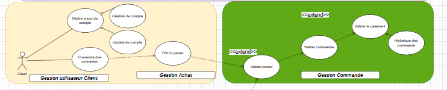

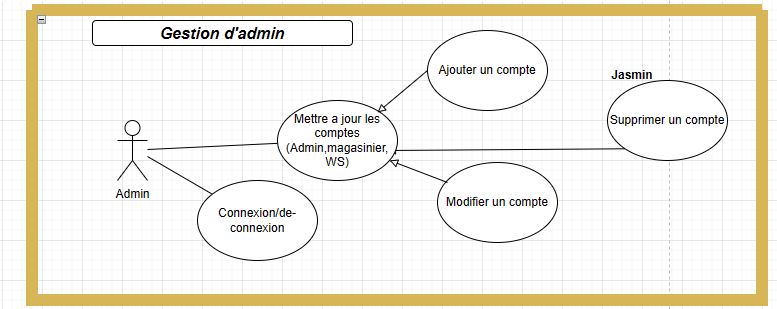
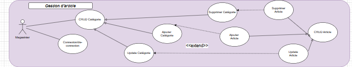
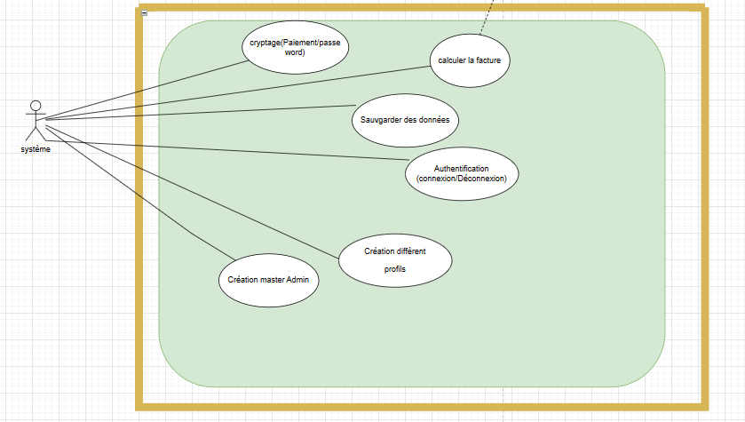
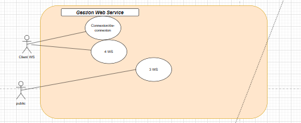

# analyse organique

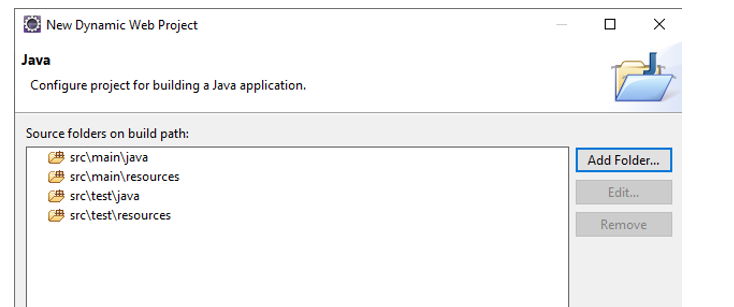
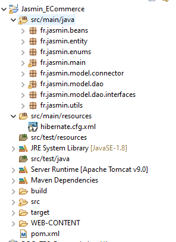
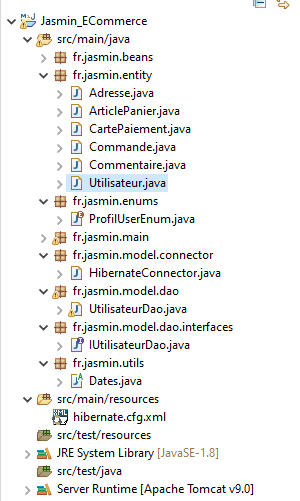
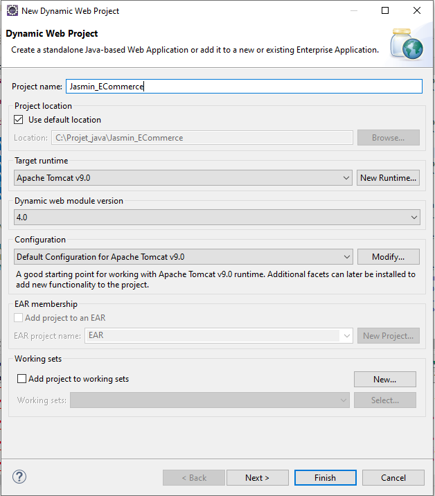

# méthode projet

Agile
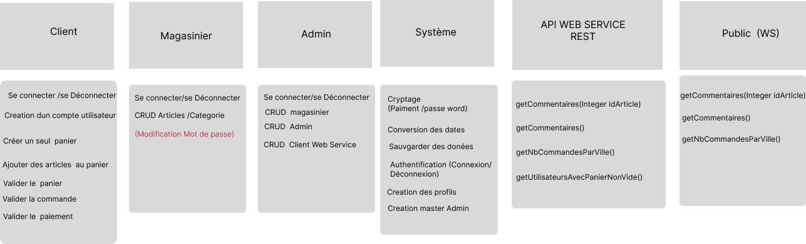

# proof of concept POC

Enums

# technologie utilisé

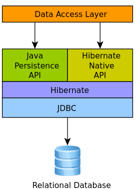

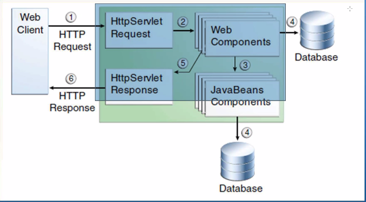

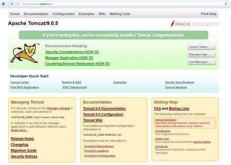

# découpe en projet

Analyse en commun

# modèle MVC

base mysql
Ctrl pour le controleur
view (web tomcat) WebContent

# la POO

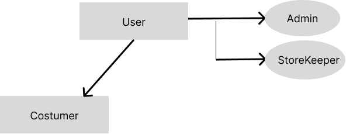
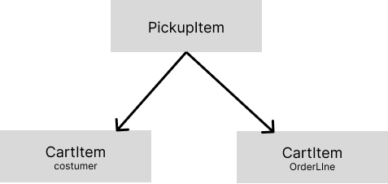
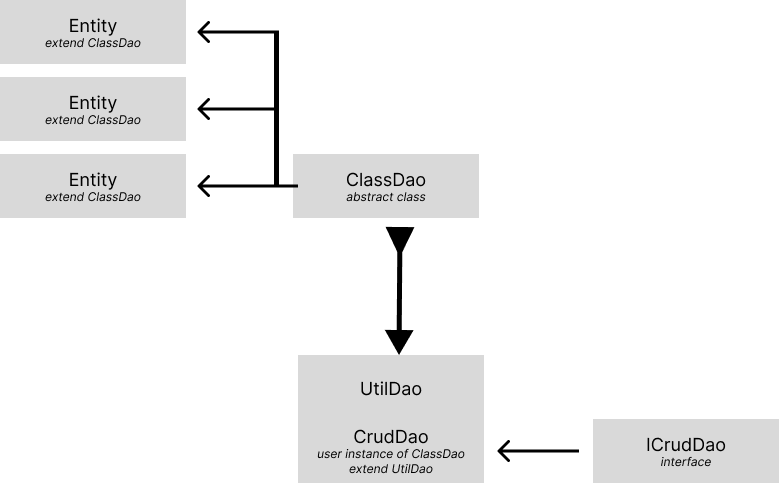

# delveloppement

partage en équipe

# test unitaire

test par entité.

# test d'intégration

test par entité.

# designe front end

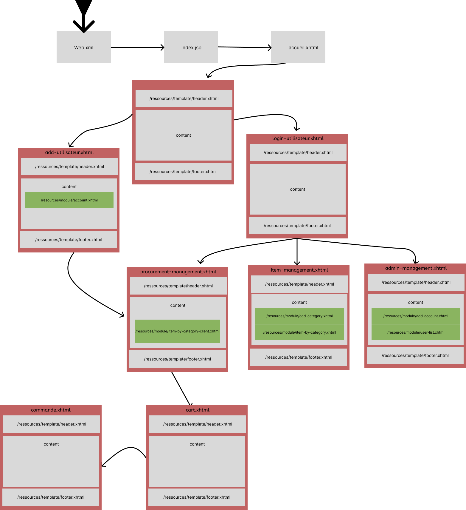

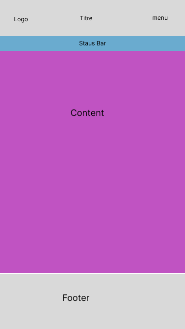
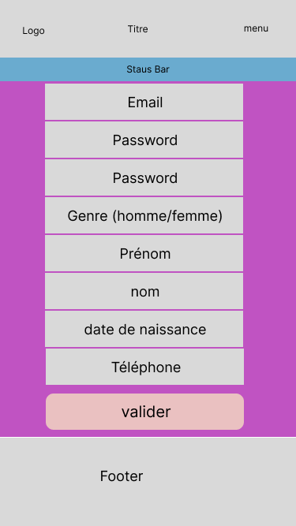
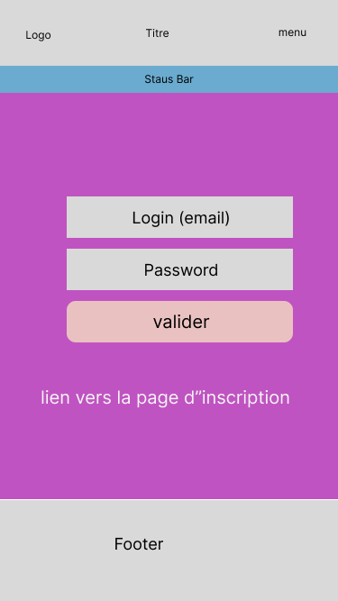
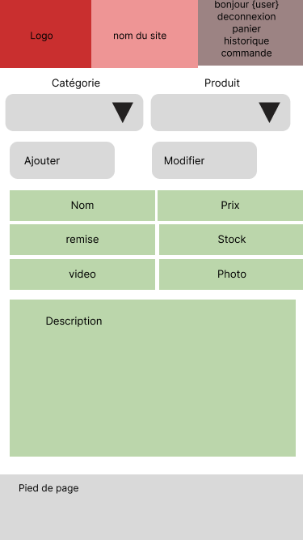
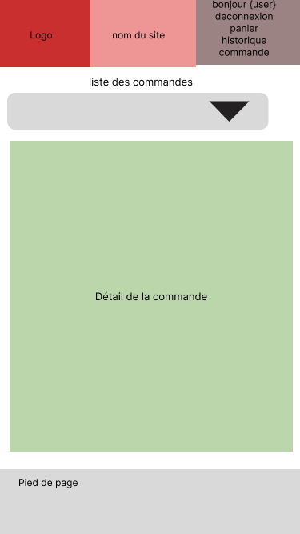

# détail technique

Jeux de test
limite de la cascade.all

## génération aléatoire de client, produit, commande etc..

DataTest
